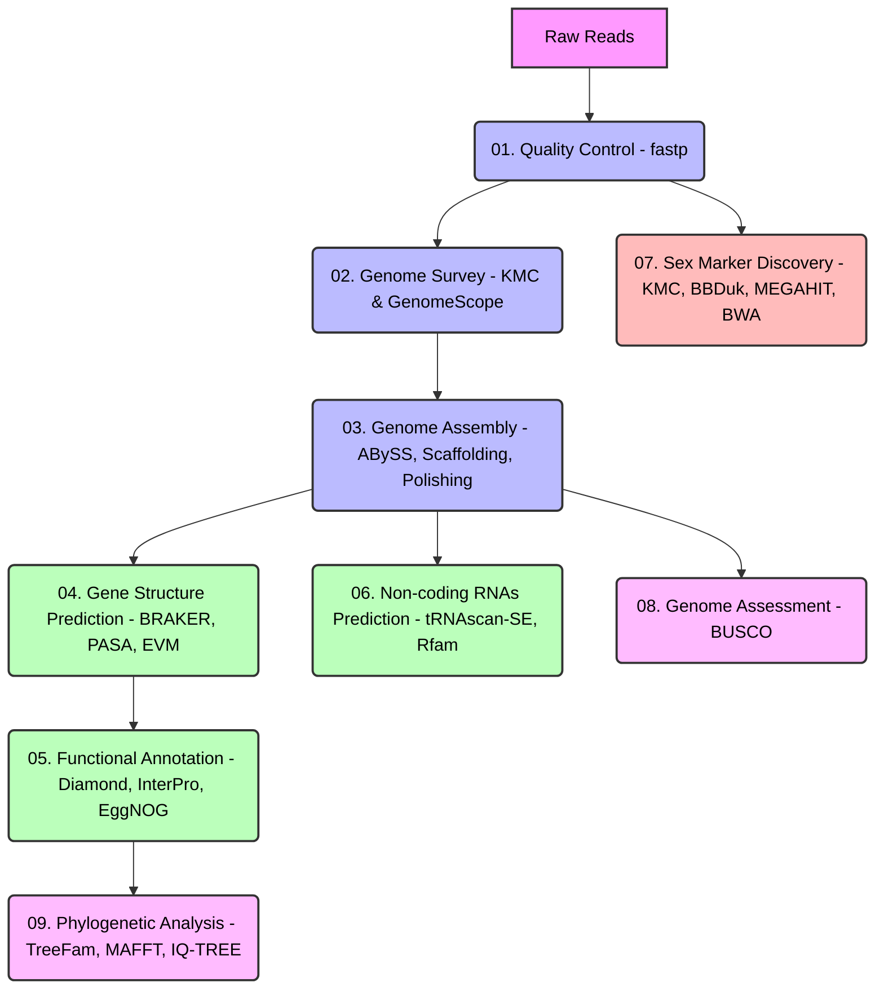

# Thenus australiensis Sex Marker Pipeline

This repository contains a reproducible genomics pipeline for the *Thenus australiensis* sex marker discovery, genome assembly, and phylogenetic analysis.

To improve reproducibility and management, the original monolithic script instructions have been broken down into numbered bash scripts, a centralized configuration file, and managed via `pixi`.

## Pipeline Workflow



## 1. Tool Setup

We use **Pixi** to manage dependencies and ensure a reproducible environment across all steps.

### Install Pixi
If you do not have Pixi installed, run:
```bash
curl -fsSL https://pixi.sh/install.sh | bash
```

### Initialize the Environment
In the root directory of this project (where `pixi.toml` is located), run:
```bash
pixi install
```
This command will automatically download and install all necessary tools (e.g., `fastp`, `kmc`, `abyss`, `samtools`, `bwa`, `megahit`, `busco`, etc.) into an isolated environment without affecting your host system.

## 2. Database Installation Step

Several steps in this pipeline require external databases. Ensure you download and set them up before running the corresponding scripts.

### 2.1 EggNOG Mapper Database
For functional annotation (Step 5.4), download the eggNOG database:
```bash
pixi run bash -c "download_eggnog_data.py --data_dir db/eggnog_db"
```

### 2.2 NCBI NR & Swiss-Prot Databases
For Diamond BLAST steps (Step 5.1 & 5.2):
```bash
mkdir -p db/uniprot
# Download and make Diamond databases
# Example for Swiss-Prot:
# wget https://ftp.uniprot.org/pub/databases/uniprot/current_release/knowledgebase/complete/uniprot_sprot.fasta.gz
# diamond makedb --in uniprot_sprot.fasta.gz -d db/uniprot/uniprot_sprot
```

### 2.3 Rfam Database
For non-coding RNA prediction (Step 6):
```bash
mkdir -p rna/db
wget https://ftp.ebi.ac.uk/pub/databases/Rfam/CURRENT/Rfam.cm.gz -O rna/db/Rfam.cm.gz
gunzip rna/db/Rfam.cm.gz
cmpress rna/db/Rfam.cm
```

## 3. Configuration Management

This pipeline utilizes a centralized configuration file: `config.sh`.
Before running the scripts, modify `config.sh` to match your local paths and computational resources.

### Example `config.sh`:
```bash
#!/bin/bash
# Central configuration file for Thenus australiensis sex marker workflow

# Directories
export BASE_DIR="$PWD"
export DATA_DIR="$BASE_DIR/data"
export RESULT_DIR="$BASE_DIR/result"
export LOG_DIR="$BASE_DIR/logs"

# Ensure directories exist
mkdir -p "$DATA_DIR" "$RESULT_DIR" "$LOG_DIR"

# Compute resources
export THREADS=16
export MAX_MEMORY="80G"
```

All scripts in the `scripts/` directory will automatically `source config.sh` at runtime to obtain the correct paths and resource constraints.

## 4. Running the Pipeline

The pipeline is organized into modular numbered scripts located in the `scripts/` folder. You can run individual steps or the entire pipeline using `pixi`.

### Running Individual Steps
You can run specific tasks defined in `pixi.toml`. For example:
```bash
pixi run step_01_qc
pixi run step_02_survey
pixi run step_07_sex_marker
```

To list all available tasks, you can check the `[tasks]` section in `pixi.toml`.

### Running the Complete Pipeline
If you want to run the entire pipeline sequentially, you can execute the master run script:
```bash
./run_all.sh
# or
pixi run run_all
```

Logs and intermediate outputs will be placed in the respective directories defined within `config.sh`.
